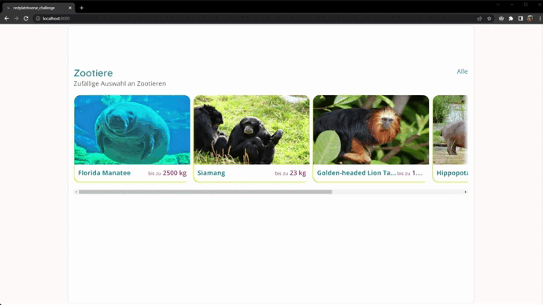

# Restplatzbörse Coding Challenge


Rebuilt teaser slider according to given design and function description using Vue.js 3.

## Project setup

```
npm install
```

### Compiles and hot-reloads for development

```
npm run serve
```

### Compiles and minifies for production

```
npm run build
```

### Lints and fixes files

```
npm run lint
prettier --write .
.\node_modules\.bin\eslint src\** --fix
```

### Customize configuration

See [Configuration Reference](https://cli.vuejs.org/config/).
